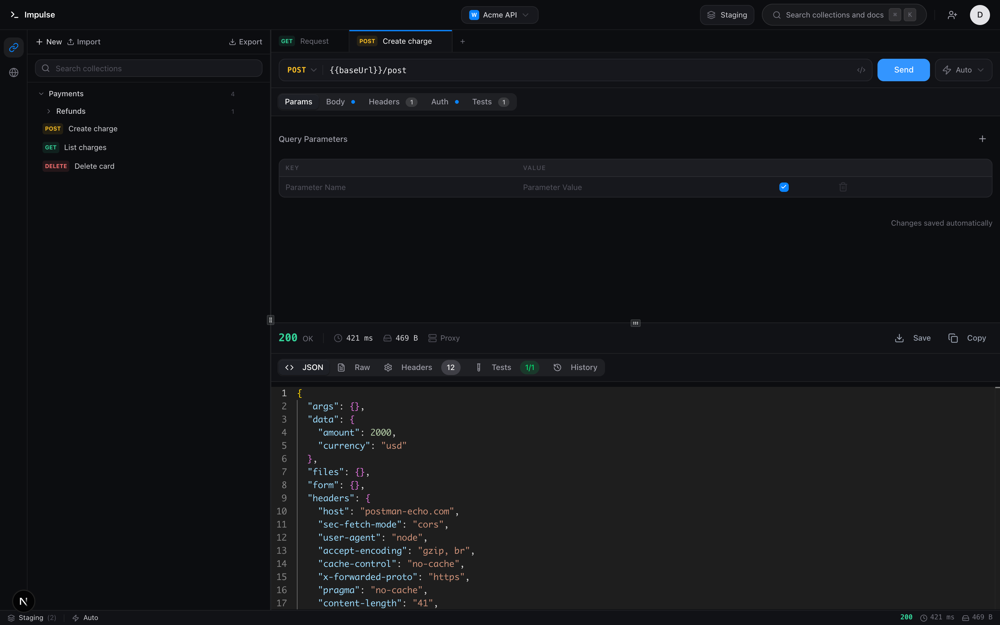
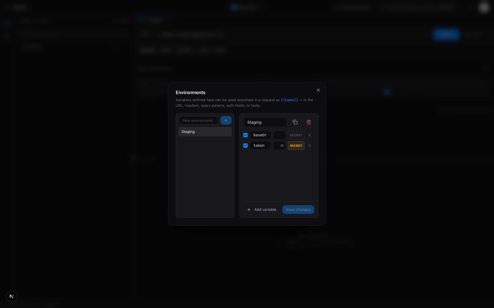
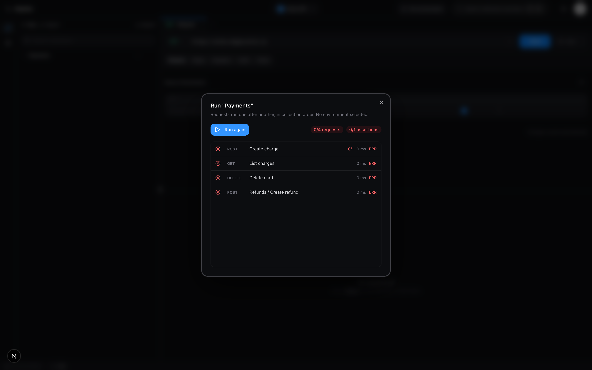
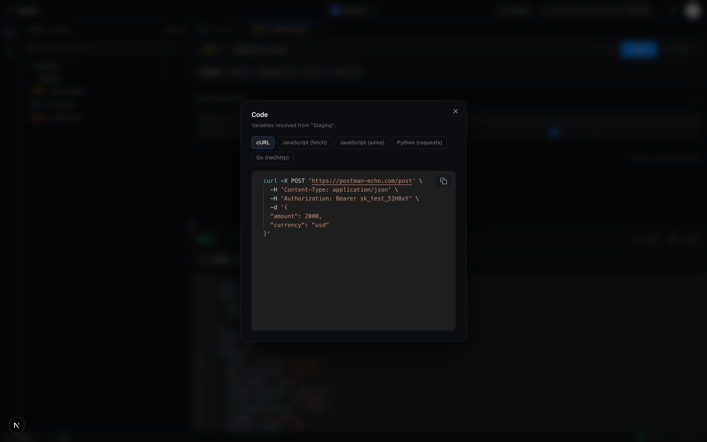
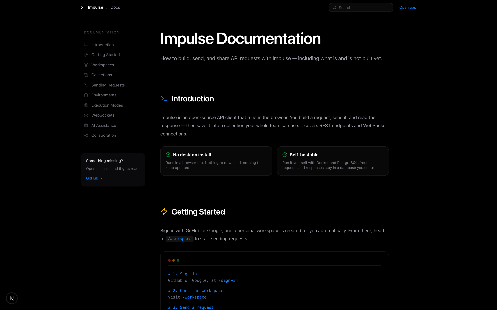
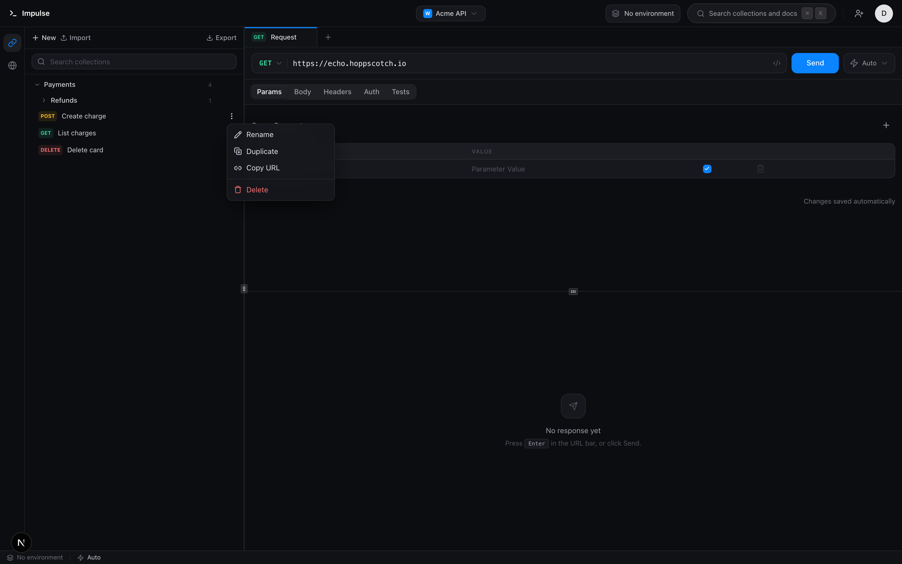
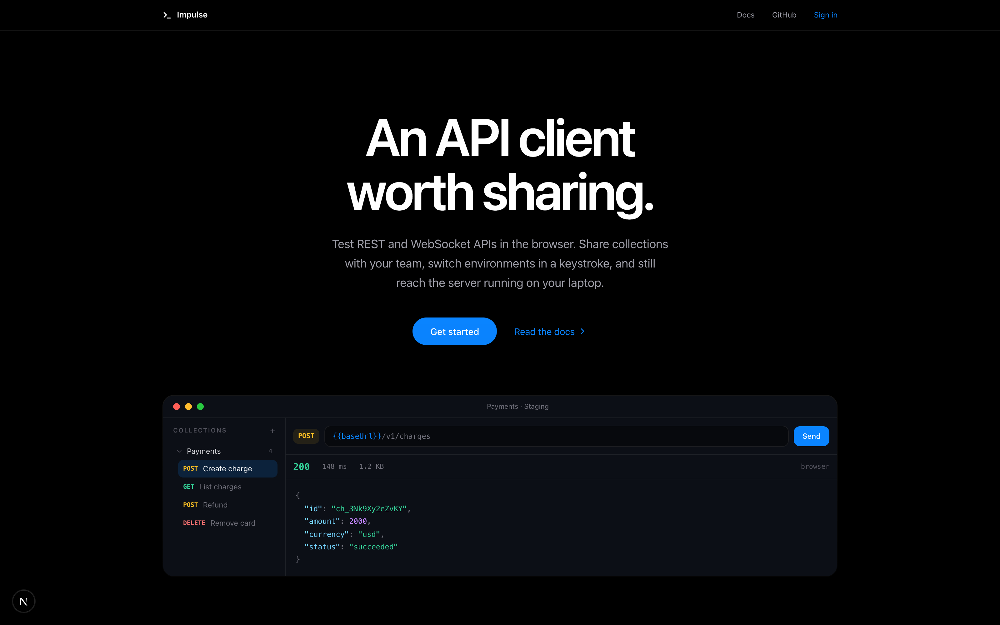

<div align="center">

# Impulse

### An API client worth sharing

Test REST and WebSocket APIs in the browser. Share collections with your team,
switch environments in a keystroke, and still reach the server running on your laptop.

[Documentation](docs/summary.md) · [Project overview](about.md) · [Contributing](CONTRIBUTING.md) · [Security](SECURITY.md)

<br />



</div>

<br />

## Why another API client

Postman is a heavy desktop install for a task that suits a browser tab, and team
collaboration on collections is the feature teams most want and most often pay for.
Impulse starts from shared workspaces rather than bolting them on.

The part worth understanding is **where a request is sent from**, because that decides
what it can reach.

| Mode | Runs on | Reaches `localhost` | Blocked by CORS | Sees all response headers |
|---|---|---|---|---|
| **Browser** | Your machine | ✅ | ❌ | ❌ safelisted only |
| **Proxy** | The server | ❌ | ✅ | ✅ |
| **Auto** *(default)* | Browser, then proxy | ✅ first try | ✅ falls back | depends which won |

Browser-only clients cannot reach an API that does not send CORS headers — which is most
of them. Server-only clients cannot reach `http://localhost:8080`, which is the thing
developers most want to test. Impulse ships both and tries the browser first, falling
back **only** on a transport failure. A real 404 is shown as a 404, never retried down a
different path.

The proxy fetches user-supplied URLs, which is textbook SSRF, so it is authenticated,
rate limited, time and size capped, and every target — including each redirect hop — is
checked against private and link-local ranges *after* DNS resolution. A hostname that
resolves to loopback is caught too.

<br />

## Features

<table>
<tr>
<td width="50%" valign="top">

**Request building**
- GET, POST, PUT, PATCH, DELETE
- JSON, text, XML, GraphQL, form-data, url-encoded
- Monaco editor with syntax highlighting and formatting
- Bearer, Basic, and API key auth
- Paste a `curl` command to fill the whole request

</td>
<td width="50%" valign="top">

**Team workflow**
- Shared workspaces with Admin / Editor / Viewer roles
- Nested collection folders
- Single-use invite links, 7-day expiry
- Import **and** export Postman v2.1
- Collection runner with per-request results

</td>
</tr>
<tr>
<td width="50%" valign="top">

**Environments**
- `{{baseUrl}}` substitution across URL, headers, params, auth, and body
- Per-person active environment — teammates can target different ones
- Secret values masked in the UI

</td>
<td width="50%" valign="top">

**After the response**
- Declarative assertions on status, timing, headers, JSON paths
- Run history with replay
- Export any request as cURL, fetch, axios, Python, or Go
- WebSocket debugger with a live frame log

</td>
</tr>
</table>

<br />

## Screenshots

<details open>
<summary><b>Environments</b> — one collection, many targets</summary>
<br />



Write `{{baseUrl}}` once and point the same collection at local, staging, or production.
A variable with no value is left in the request literally rather than blanked, and the
app names what went unresolved — sending `https:///users` silently is far harder to debug.

</details>

<details>
<summary><b>Collection runner</b> — run everything in order</summary>
<br />



Requests run sequentially, not in parallel: collections routinely depend on each other's
side effects, and firing them at once makes results non-deterministic.

</details>

<details>
<summary><b>Export as code</b> — hand a teammate something that runs</summary>
<br />



Generated from the composed request — variables resolved, auth applied, params folded in
— so the snippet reproduces exactly what Send puts on the wire.

</details>

<details>
<summary><b>Documentation</b></summary>
<br />



</details>

<details>
<summary><b>Collections</b> — rename, duplicate, move, copy</summary>
<br />



Renaming happens inline on the row rather than in a modal: naming a request is a
half-second edit, and covering the screen to do it loses the context you were naming it from.

</details>

<details>
<summary><b>Landing page</b></summary>
<br />



</details>

<br />

## Quickstart

**Requirements:** Node 22 ([`.nvmrc`](.nvmrc)), Docker, and a GitHub or Google OAuth app.

```bash
git clone https://github.com/Somilg11/impulse.git
cd impulse

cp .env.example .env     # then fill in the values
npm install

docker compose up -d     # Postgres on :5433
npx prisma migrate dev   # apply migrations and generate the client

npm run dev              # → http://localhost:3000
```

Sign in with GitHub or Google and a personal workspace is created automatically.

> If sign-in returns a 500 with `P2021 table does not exist`, migrations were never
> applied to your database. Run `npx prisma migrate dev`.

<br />

## Scripts

| Command | What it does |
|---|---|
| `npm run dev` | Start Postgres and the dev server |
| `npm run build` | Production build |
| `npm test` | Unit suite (169 tests, ~0.5s) |
| `npm run typecheck` | `tsc --noEmit` |
| `npm run lint` | ESLint |
| `npx prisma studio` | Browse the database |
| `npx prisma migrate status` | Check the schema matches the migrations |

<br />

## Architecture

```
src/
├── app/                    Next.js App Router
│   ├── api/proxy/          server-side execution, SSRF-guarded
│   ├── api/auth/           Better Auth handler
│   └── workspace/          the product surface
├── lib/                    cross-cutting concerns
│   ├── authz.ts            membership and role assertions
│   ├── request-pipeline.ts variables → auth → body → ExecRequest
│   ├── ssrf.ts             private-address guard
│   └── http-display.ts     method and status presentation
└── modules/                feature-sliced: actions, components, hooks, store
    ├── request/  collections/  environments/
    └── workspace/  invites/  realtime/  ai/  layout/
```

| Layer | Choice | Why |
|---|---|---|
| Framework | Next.js 16, App Router | Server Components render workspace data without a client round trip; Server Actions remove a REST layer for CRUD |
| Database | PostgreSQL + Prisma | Real foreign keys and cascade deletes across workspace → collection → request → run; migrations reviewable in a PR |
| Auth | Better Auth | Self-hosted OAuth owning its tables in *your* database — no identity vendor, no per-user pricing |
| State | Zustand + TanStack Query | Zustand for what the user is doing, Query for what the server knows |
| UI | Radix + Tailwind v4 | Accessible primitives, styled against named design tokens |
| Editor | Monaco | Self-hosted, not CDN-loaded — works offline and under a strict CSP |

Deeper write-up, including the trade-offs behind each choice:
[`docs/summary.md`](docs/summary.md).

<br />

## Security

`npm audit` reports **0 vulnerabilities**. CI enforces typecheck, lint, tests, and
migration-drift detection on every push.

- Every `"use server"` export is a public HTTP endpoint, so every action taking an id
  authorizes the caller against **that object** via [`src/lib/authz.ts`](src/lib/authz.ts)
- Roles ranked `VIEWER < EDITOR < ADMIN`, enforced server-side
- Browser-mode requests use `credentials: "omit"` — your cookies never reach a third-party API
- CSP, HSTS, frame, content-type, referrer, and permissions policies on every route

Known limitations are documented rather than hidden — see [`SECURITY.md`](SECURITY.md).
Most relevant: response bodies are stored unencrypted, so **do not point a shared
deployment at a production API with live credentials**.

<br />

## Roadmap

Built and shipping: environments, auth schemes, body types, nested folders, import/export,
assertions, run history, collection runner, code generation, cURL import.

Not built yet, stated plainly:

- **Desktop app** — would remove the CORS limit and the proxy at once
- Collection-level shared headers and pre-request scripts
- File uploads (form-data carries text fields only)
- Header autocomplete, cookie jar

<br />

## Contributing

Setup, branching model, commit conventions, and the security rules a reviewer will block
on: [`CONTRIBUTING.md`](CONTRIBUTING.md).

Vulnerabilities: please report privately — see [`SECURITY.md`](SECURITY.md).

<br />

## License

[MIT](LICENSE) · Built by [Somil Gupta](https://github.com/Somilg11)
